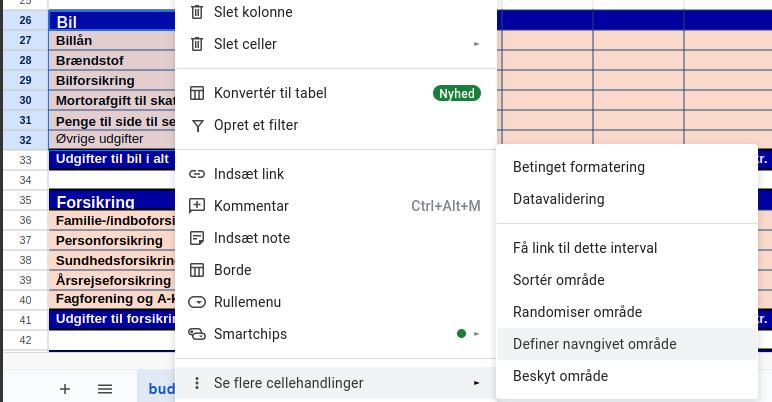
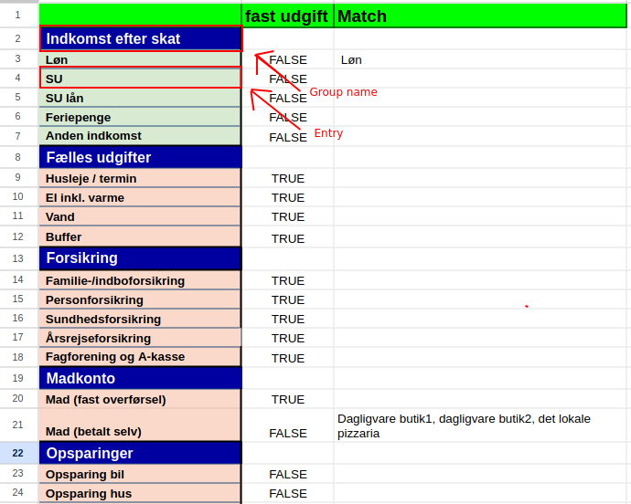
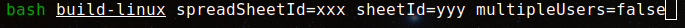
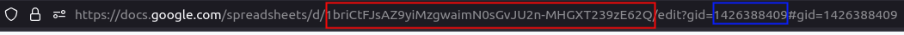
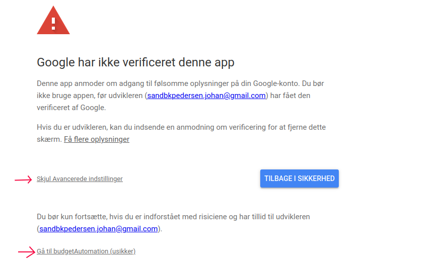

# OrdoBudget

Automation tool for managing budgets.

## Setup Guide

### Google sheets
- Create a copy of the template
    - https://docs.google.com/spreadsheets/d/15_tHTkJm-uSqrthHL0GaDiI3vPNxEBI2yRj93MtFZ4M/edit?usp=drive_link
- Adjust entries by adding or removing rows
- For each entry group, mark group name and corresponding entries, as 'Named Range / navngivet område' 
    - 
- When done, clik 'Update config' button
    - All named ranges are now copied to the config sheet
- Go to sheet 'config'
- Under 'fast udgift', mark TRUE or FALSE if this entry is a fixed expense
  - When a entry is marked as a fixed expense. The program does not overwite the data for the given entry
  - This is useful if you have a second billing account, where you transfer a set amount every month, but still want to know how much goes to each entry
- Under 'Match', write name to identify all matches for given entry
  - You can look at the excrpts from your bank and find all the reoccuring ones. 
  - To create a match, the excrpt just have to contain the text of 1 of the comma seperated mathes
  - The same match can be also be used for different entries.
- 

### Local setup

- make ordoBudget folder
- Get *client secret* file from Johan and save it in this folder

#### Nerd approach

- requires *git* and *go* to be installed

- Clone repo
- Run build script specifying **spreadSheetId**, **sheetId** and **multipleUsers**
  - 
  - **SpreadsheetId**, and **sheetId** is found in the url of the speadsheet.
    -  **spreadsheetId** is marked in $${\color{red}Red}$$
    -  **sheetid** is marked in $${\color{blue}Blue}$$
    - 
  - **multipleUsers**, Specify if budget is for yourself or also another person.
  - script builds to '~/ordoBudget'
  - move program to ordoBudget folder with client secret

#### Normal way

- Ask Johan to make an executable file for you :-)
- Executable file can be sent via gmail if you just upload it as a file.
- On windows it's sometimes necessary to tell Windows Defender not te delete the program.
- Put executable in ordoBudget folder with client secret

### Run program

- Download excrpt file from bank as a *csv* (excel) file type, and put it in ordoBudget folder.

- First time running program you get message like this
  - 
- click or ctrl+click the link and give the program access to the sheets you just created.
  - 

- Next, specify the month to update for and location of csv file containing excerpts, when prompted
    - 
